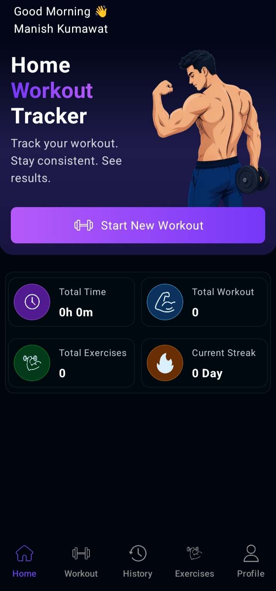
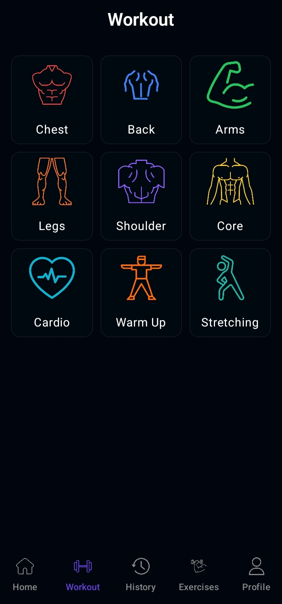
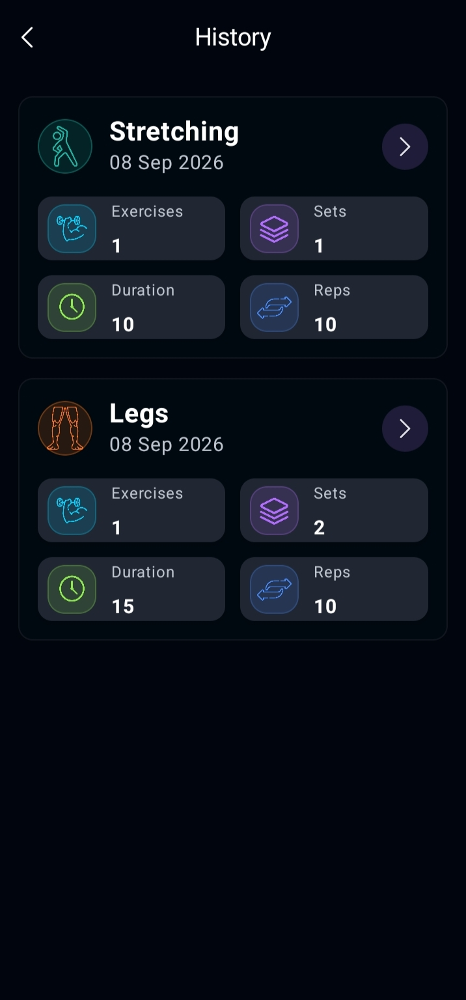
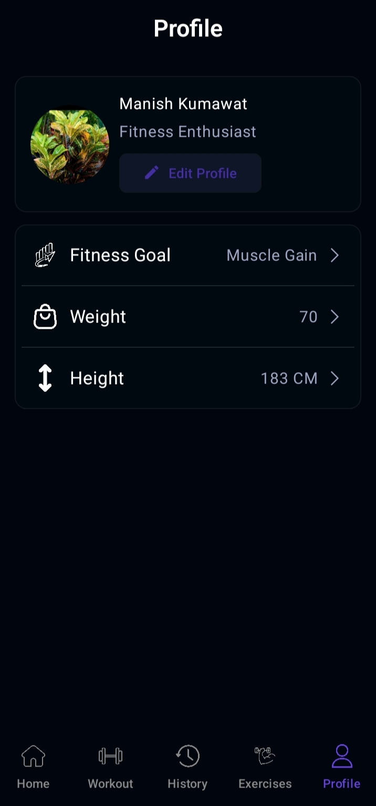
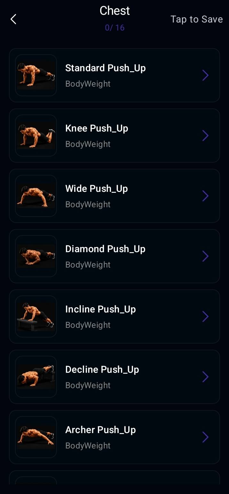
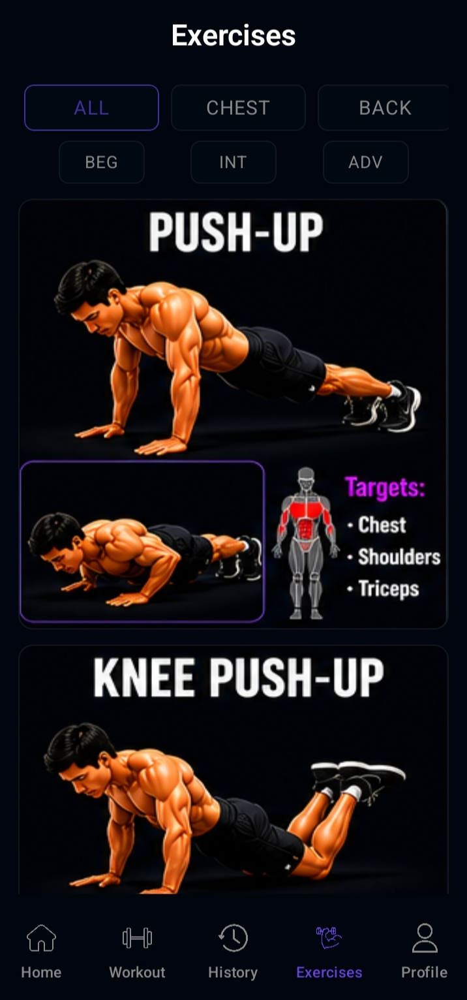

# 🏋️ HomeFit

> A modern Android workout tracking application built with **Kotlin** and **Jetpack Compose**.

HomeFit is a simple and modern fitness tracking app designed to help users record and monitor their workout activity. It provides a clean dark-themed interface for tracking workout duration, exercises, and workout streaks.

## 📱 Screenshots

| Home                          | Workout                             | History                             |
| ----------------------------- | ----------------------------------- | ----------------------------------- |
|  |  |  |

| Profile                             | WorkoutDetail                                | Exercise                             |
| ----------------------------------- | ----------------------------------------- | ------------------------------------- |
|  |  |  |

---

## ✨ Features

* 🏋️ **Workout Tracking**
  Record and manage your workouts.

* 🗂️ Exercise Categories
   Browse exercises by category.
  
* 📅 Workout History
   View previously completed workouts.
  
* 📊 Detailed Statistics
   Track and analyze your workout progress.
  
* ⏱️ **Workout Duration**
  Track how much time you spend working out.

* 🔢 **Exercise Tracking**
  Keep track of the total number of exercises completed.

* 🔥 **Workout Streak**
  Monitor your current workout streak and stay consistent.

* 🌙 **Modern Dark UI**
  Clean and minimal dark-themed interface.

* ⚡ **Smooth UI**
  Responsive and smooth user experience built with Jetpack Compose.

---

## 🛠️ Tech Stack

| Technology          | Usage                        |
| ------------------- | ---------------------------- |
| **Kotlin**          | Primary programming language |
| **Jetpack Compose** | UI development               |
| **Material 3**      | Modern Android UI components |
| **MVVM**            | Application architecture     |
| **Coroutines**      | Asynchronous programming     |
| **Flow**            | Reactive data handling       |

## 🎯 Project Goals

The main goals of HomeFit are:

* Build a practical Android fitness application
* Practice modern Android development
* Create a clean Jetpack Compose UI
* Implement workout tracking
* Practice state management and app architecture
* Build a project suitable for an Android development portfolio

---

## 🔮 Future Improvements

Planned features may include:

* [ ] Exercise search
* [ ] Progress charts
* [ ] Personal workout plans
* [ ] Custom exercises
* [ ] Notifications and reminders
* [ ] Cloud synchronization
* [ ] User authentication
* [ ] Offline data persistence

---

## 📚 What I Learned

While developing HomeFit, I practiced:

* Kotlin programming
* Jetpack Compose
* Material 3
* State management
* MVVM architecture
* Navigation
* UI design
* Coroutines and Flow
* Building reusable Compose components
* Creating responsive Android interfaces

---

## 🤝 Contributing

Contributions, suggestions, and improvements are welcome.

If you find a bug or have an idea for improving HomeFit, feel free to open an issue or submit a pull request.

---

## 📄 License

This project is created for learning and portfolio purposes.

---

## 👨‍💻 Developer

**Manish Kumawat**

If you like this project, consider giving it a ⭐ on GitHub!
